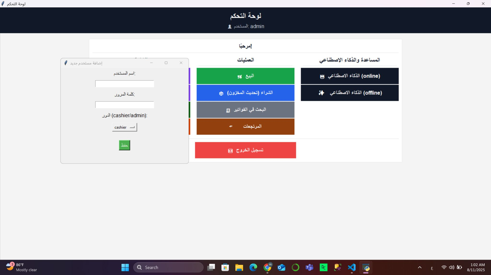
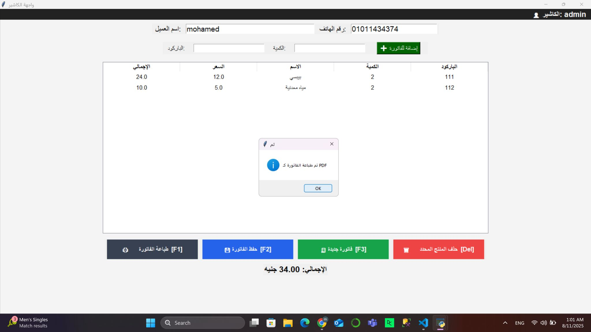
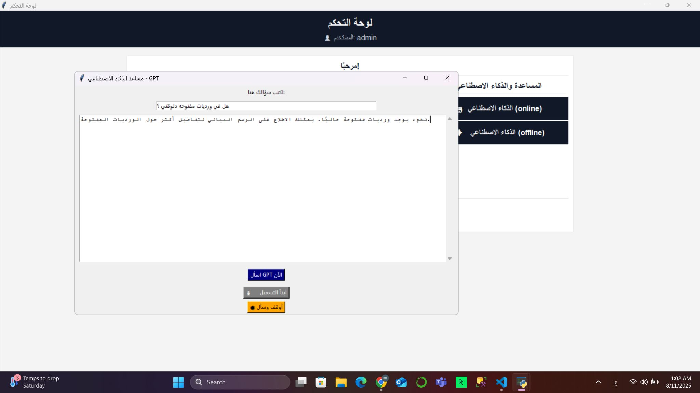
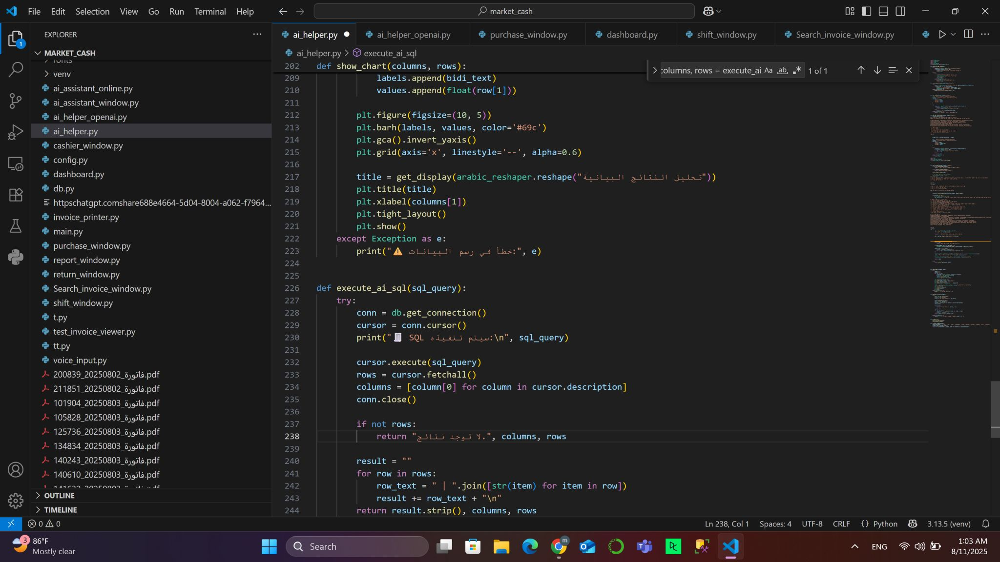

# Smart Cashier (AI-Powered POS)

📌 **Demo repository – contains screenshots and project description only (no source code available).**

This project is a **smart cashier (POS) application** built with **Python (Tkinter)** and **SQL Server**, enhanced with **AI features** for sales and inventory analysis.

## 🔑 Features
- 💵 Sales, purchases, and returns operations
- 📊 Full reports and charts (Matplotlib)
- 👤 Dynamic role-based access: add/remove users and set permissions
- 📂 Invoice archiving to optimize database size
- 🤖 Integrated AI Assistant:
  - **Offline:** via Ollama 3 (LLM model on device, no internet required)
  - **Online:** via OpenAI API for advanced analytics and insights
- 🎤 Voice & text queries for interactive data analysis  
  *(Example: “What was the best-selling product this month?”)*

## ⚙️ Tech Stack
Python (Tkinter) – SQL Server – PyODBC – Matplotlib – Threading – PyInstaller – Ollama – OpenAI API

## 📸 Screenshots
  
  
  
  

## 📌 Note
The source code is not shared publicly to protect development rights.  
This repository is for **demonstration purposes** only (screenshots + project description).  

For collaboration, inquiries, or to test the full version, feel free to contact me on [LinkedIn](https://www.linkedin.com/in/abdelati88/).
